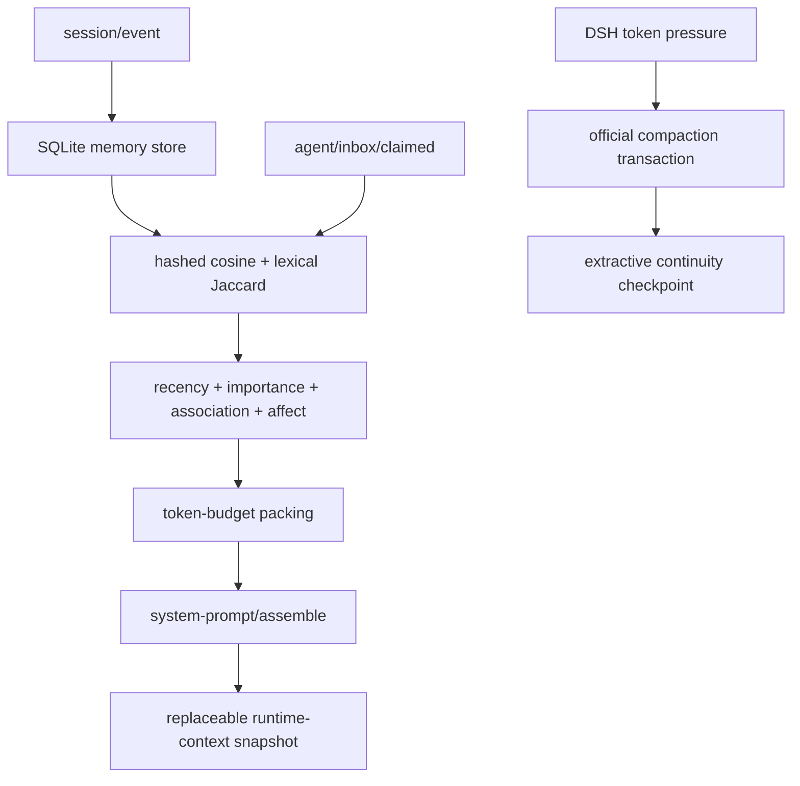

# REMI

> Adaptive Memory for AI · DeepSeek Harness plugin · v0.2.0

[English](README.md) | [简体中文](README.zh-CN.md)

REMI is a context and long-term memory plugin for [DeepSeek Harness](https://github.com/deepseek-ai/deepseek-harness). It observes durable DSH session events, stores retrievable memories in SQLite, and assembles a bounded runtime-context window before each model request.

REMI is not a standalone web application, does not replace the Harness Agent Loop, and does not train or fine-tune a model.

> **Status:** Experimental. Do not use REMI in production environments yet.

## Features

- Observes `user/message`, `assistant/message`, and `tool/result` through `session/event`.
- Stores memories, affect hints, retrieval traces, and association edges with the built-in Node.js `node:sqlite` module.
- Captures the current query at `agent/inbox/claimed` and injects one bounded runtime-context snapshot through `system-prompt/assemble`.
- Ranks candidates with hashed bag-of-tokens cosine, lexical Jaccard, recency, importance, association, and affect signals.
- Reinforces bounded Hebbian edges between memories selected in the same retrieval window.
- Optionally requests structured affect JSON through DSH `ctx.llm.stream()`; no model training is involved, and failures fall back to a local heuristic.
- Extends the official `BasicCompactionEngine`, preserving the Harness compaction transaction while replacing only the checkpoint summarizer.
- Emits JSONL telemetry without raw query text and stores complete `RetrievalTrace` records in SQLite.

## Requirements

- Node.js `^22.19.0 || >=24.0.0`
- pnpm `11.x`
- DeepSeek Harness API `0.1.5-rc.2`, or a DSH Desktop build verified for compatibility

The compile-time baseline is DeepSeek Harness commit `c291e7961a515f6d7af9304e7fd1d257929aef26`. See [API compatibility](docs/API_COMPATIBILITY.md) for the verified contracts and upgrade checklist.

## Install and build

```powershell
git clone https://github.com/Hoshino910/REMI.git
cd REMI
pnpm install
pnpm build
pnpm typecheck
pnpm test
```

The built DSH plugin entry is:

```text
packages/dsh-adapter/dist/index.js
```

## Add REMI to DeepSeek Harness

Two configuration examples are included:

- [examples/deepseek-harness/cordis.yml](examples/deepseek-harness/cordis.yml) is a replacement compaction group for current `standard`/`ptc` presets.
- [examples/deepseek-harness/cordis.patch.yml](examples/deepseek-harness/cordis.patch.yml) is an overlay for profiles that still mount `id: compaction-basic` at the root.

Update the plugin and data paths before starting DSH:

```yaml
- id: selective-memory
  name: 'file:///C:/path/to/REMI/packages/dsh-adapter/dist/index.js'
  config:
    databasePath: 'C:/path/to/dsh-data/remi.sqlite'
    telemetryPath: 'C:/path/to/dsh-data/remi-telemetry.jsonl'
    telemetryEnabled: true
    transparentWindowEnabled: true
    retrievalTokenBudget: 1400
    retrievalLimit: 8
    minRetrievalScore: 0.12
    similarityWeight: 0.55
    recencyWeight: 0.15
    importanceWeight: 0.10
    associationWeight: 0.15
    emotionWeight: 0.05
    hebbianEnabled: true
    emotionAnalysisEnabled: false
    compactionSummaryTokenBudget: 900
    compactionThresholdRatio: 0.80
    compactionRetainRatio: 0.16
    autoCompaction: true
```

On Windows, the packaged DSH Desktop ESM loader requires a `file:///C:/...` URL for the plugin entry. A plain `C:/.../index.js` path is not accepted.

Start a profile with an additional patch:

```powershell
dsh --profile web --patch C:/path/to/cordis.patch.yml
```

Only one `ctx.compaction` provider may exist in a Cordis realm. Disable the original `compaction-basic` provider or replace the complete isolated compaction group as shown in the examples.

## Configuration reference

### Storage and telemetry

| Option | Default | Description |
|---|---:|---|
| `databasePath` | `.dsh-memory/memory.sqlite` | SQLite sidecar path; use an absolute path for deployments |
| `telemetryPath` | `.dsh-memory/telemetry.jsonl` | JSONL telemetry path |
| `telemetryEnabled` | `true` | Enable JSONL telemetry |
| `maxCandidates` | `2000` | Maximum memories loaded for one retrieval |
| `maxMemoryChars` | `8000` | Maximum characters stored from one observed event |

The SQLite database contains raw conversation text. Protect it at least as strictly as the Harness session store. Do not commit SQLite, WAL, SHM, or telemetry files to Git.

### Retrieval and transparent window

| Option | Default | Description |
|---|---:|---|
| `transparentWindowEnabled` | `true` | Add a REMI runtime-context snapshot during prompt assembly |
| `retrievalTokenBudget` | `1400` | Final rendered token budget for one memory window |
| `retrievalLimit` | `8` | Maximum memories in one window |
| `minRetrievalScore` | `0.12` | Minimum normalized candidate score |
| `recencyHalfLifeDays` | `30` | Time scale for hyperbolic recency decay |
| `similarityWeight` | `0.55` | Text similarity weight |
| `recencyWeight` | `0.15` | Recency weight |
| `importanceWeight` | `0.10` | Message importance weight |
| `associationWeight` | `0.15` | Hebbian association weight |
| `emotionWeight` | `0.05` | Affect similarity weight |

Weights are normalized at runtime. `retrievalTokenBudget` applies only to the rendered REMI `<memory-context>` block; it is not a hard limit for the complete model request.

### Hebbian associations

| Option | Default | Description |
|---|---:|---|
| `hebbianEnabled` | `true` | Enable co-activation edges |
| `hebbianSeedLimit` | `4` | High-scoring seed memories used for graph expansion |
| `hebbianEdgeLimit` | `256` | Maximum association edges read per retrieval |
| `hebbianLearningRate` | `0.08` | Reinforcement coefficient for one co-activation |
| `hebbianMaxWeight` | `1` | Maximum stored edge weight |
| `hebbianHalfLifeDays` | `45` | Exponential edge-weight half-life |

An edge means that two memories were selected together. It does not establish factual correctness, causality, or a user preference, and it does not train a neural network.

### Affect analysis

| Option | Default | Description |
|---|---:|---|
| `emotionAnalysisEnabled` | `false` | Request structured affect JSON from a DSH model |
| `emotionAnalysisProvider` | empty | Optional fixed provider; otherwise use the session route |
| `emotionAnalysisModel` | empty | Optional fixed model; set it together with the provider |
| `emotionAnalysisMaxTokens` | `160` | Maximum output tokens for the classifier call |

Model analysis uses the provider already configured in DSH. It is an inference-only request with a strict JSON prompt. On failure, REMI records the error and continues with a local heuristic.

```ts
interface EmotionVector {
  valence: number      // -1..1
  arousal: number      // 0..1
  dominance: number    // 0..1
  labels: string[]     // up to three short labels
  confidence: number   // 0..1
  source: 'model' | 'heuristic' | 'fallback'
}
```

Affect values are low-weight retrieval hints. They must not be treated as a psychological diagnosis or as a durable fact about the user.

### Compaction

| Option | Default | Description |
|---|---:|---|
| `autoCompaction` | `true` | Enable official token-pressure compaction |
| `compactionSummaryTokenBudget` | `900` | Estimated budget for the extractive checkpoint |
| `compactionThresholdRatio` | `0.80` | Trigger ratio relative to model context capacity |
| `compactionRetainRatio` | `0.16` | Recent source-text ratio retained by the transaction |

REMI subclasses `BasicCompactionEngine`. Locks, token-pressure checks, surface replacement, manual flush, and the `compaction/start` → `compaction/summary` → `compaction/end` transaction remain owned by DeepSeek Harness.

## Architecture



### Event observation

The observer converts text from user, assistant, and tool-result events into `MemoryRecord` values. Messages generated by REMI and compaction checkpoints are ignored to prevent feedback loops. `(session_id, source_event_seq)` provides idempotency when an event is replayed.

REMI observes live events after installation. It does not backfill older session history automatically.

### Retrieval scoring

The local deterministic similarity placeholder is:

```text
Similarity = 0.65 × hashed bag-of-tokens cosine
           + 0.35 × lexical Jaccard
```

The default candidate score is:

```text
Score = 0.55 × Similarity
      + 0.15 × Recency
      + 0.10 × Importance
      + 0.15 × Association
      + 0.05 × Affect
```

Recency uses `1 / (1 + ageDays / halfLifeDays)`. After packing candidates, REMI measures the complete rendered `<memory-context>` and removes the lowest-priority selected items until the configured budget is satisfied.

### Transparent context window

REMI captures the current direct user query at `agent/inbox/claimed`, then performs asynchronous retrieval in the cooperative `system-prompt/assemble` waterfall. Its context has the stable name `dsh-selective-memory:transparent-window`.

- One REMI window is present in an assembly.
- The current DSH runtime-context snapshot supersedes earlier snapshots on the active surface.
- DSH still stores snapshot events in the durable log for replay and auditing.

“Transparent” means that users do not have to copy summaries or manage context blocks manually. It does not mean hidden or unlogged injection.

## SQLite schema

Schema v2 contains:

- `memories`: text, hashed embedding, importance, affect, access counters, and source metadata;
- `retrieval_traces`: complete scoring and selection traces;
- `memory_associations`: canonical session-local co-activation edges;
- `schema_meta`: schema version.

Opening a v1 database adds `emotion_json`, creates the association table and indexes, and updates the schema version.

## Telemetry and RetrievalTrace

JSONL event types:

- `plugin/started`
- `memory/ingested`
- `memory/retrieval`
- `memory/window`
- `memory/emotion-analysis`
- `memory/compaction`
- `plugin/error`

JSONL telemetry contains a stable query fingerprint, not the raw query or memory text. SQLite retrieval traces include component scores, selection decisions, token counts, association-edge counts, query affect metadata, and timing.

## Benchmark

Run the included dataset:

```powershell
pnpm benchmark
```

Run a custom JSONL dataset:

```powershell
node packages/benchmark/dist/cli.js C:/path/to/dataset.jsonl
```

See [examples/benchmark/sample.jsonl](examples/benchmark/sample.jsonl) for the input shape. The current runner exposes `full`, `similarity_only`, `no_recency`, and `no_importance`. Its `hitRateAtK` is a string-evidence pipeline check, not a complete quality evaluation.

## Repository layout

```text
packages/
  core/             # DSH-independent types, scoring, budgeting, compaction, traces
  store-sqlite/     # SQLite MemoryStore and schema migration
  dsh-adapter/      # DSH events, context window, affect calls, compaction, telemetry
  benchmark/        # JSONL benchmark runner
examples/
  deepseek-harness/ # Cordis group and root-overlay examples
  benchmark/        # Minimal benchmark dataset
docs/
  API_COMPATIBILITY.md
```

`packages/core` imports no DeepSeek Harness modules and makes no model calls. DSH lifecycle integration and model routing are isolated in `packages/dsh-adapter`.

## Development and verification

```powershell
pnpm build
pnpm typecheck
pnpm test
pnpm benchmark
```

Current verification results:

- 6 test files and 14 tests pass;
- every workspace package builds and type-checks;
- an isolated DSH Desktop 2.0.6 headless smoke test returned `REMI_LIVE_OK`;
- the smoke-test memory window used 470 of 600 estimated tokens;
- custom compaction reduced 1,766 estimated input tokens to 478 output tokens.

The DSH smoke test used a deterministic local provider to verify lifecycle integration and `ctx.llm.stream()`. A separate remote-provider probe returned `TRANSPORT: Connection error`; REMI successfully used its heuristic fallback, but remote service availability was not verified.

## Known limitations

- No automatic backfill for sessions created before the plugin was installed.
- No default cross-session retrieval scope.
- Hashed embeddings are placeholders with limited cross-language and synonym recall.
- No current-truth/superseded conflict resolution or deletion API.
- Hebbian edges express retrieval co-occurrence, not truth or causality.
- Affect hints have no cross-language calibration, temporal smoothing, or diagnostic meaning.
- Extractive compaction is deterministic but can omit implicit decisions or retain outdated text.
- Token counts are heuristic; actual pressure is determined by DSH `ctx.tokenMeter` and model capacity.
- DeepSeek Harness is pre-release software. Re-run the [upgrade checklist](docs/API_COMPATIBILITY.md#upgrade-checklist) before updating DSH packages.

## License

[MIT](LICENSE)

> **Early testing notice:** Do not use this plugin in production environments.
