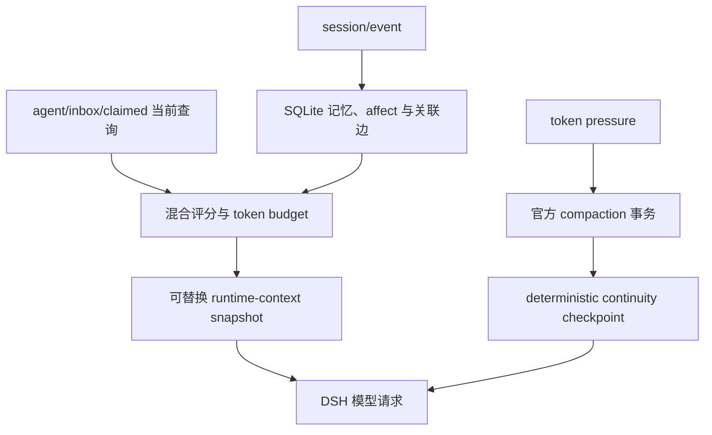

# REMI

> Adaptive Memory for AI
>
> 面向 AI 的自适应记忆与上下文管理插件 · DeepSeek Harness · v0.2 研究原型

**REMI** 面向通用长时对话与 Agent 工作流，通过选择性记忆、上下文召回和历史压缩，控制每次模型请求携带的信息量。目标是在保留关键事实、约束与任务连续性的前提下，降低长上下文带来的 token 消耗。

REMI 以 **DeepSeek Harness 插件**交付，不需要训练或修改基础模型。实现通过 Harness 的公开 Cordis 扩展点观察会话、写入 SQLite、在模型调用前召回有限记忆，并用自定义 extractive checkpoint 替换较旧的模型可见历史。时近性衰减、情绪辅助信号、Hebbian 共激活和可自定义的透明窗口构成当前实验方向，适用范围包括个人助手、知识问答、持续任务及其他长时交互。

**版本状态：**v0.2 已实现基础存储、时近性评分、预算召回、透明 runtime-context window、受限 Hebbian 图、可选情绪提示和抽取式压缩；尚未实现复杂 Ebbinghaus、current-truth/superseded 与整轮统一预算调度。降低实际费用、保持回答质量和实现用户无感连续性，仍需更大规模端到端实验验证。

v0.2 在 v0.1 最小闭环上增加可替换的透明记忆窗口、受限 Hebbian 关联图与可选情绪提示分析：



召回通过可审计、可替换的 runtime-context snapshot 进入请求；压缩事务从 DSH 当前历史生成 checkpoint，后续可通过 SQLite 召回被压缩区域的细节。

## 已实现

- `session/event` observer：观察 `user/message`、`assistant/message`、`tool/result`，忽略本插件自己的 recall 与 compaction checkpoint，按 `(session_id, source_event_seq)` 去重。
- SQLite store：使用 Node.js 内置 `node:sqlite`，启用 WAL、索引、访问计数、retrieval trace 与关联边表；schema v1 会自动迁移到 v2。
- 透明窗口：在 `agent/inbox/claimed` 捕获本轮直接用户输入，在异步 `system-prompt/assemble` 中检索，并贡献唯一命名的 runtime-context snapshot。当前窗口替换本插件同名窗口；DSH 的 active-surface projection 会让新 snapshot 取代旧 snapshot。
- 混合检索：`hashed bag-of-tokens cosine + lexical Jaccard + recency + importance + association + affect`，所有分量与选择决策写入 `RetrievalTrace`。
- Hebbian 图：同一次窗口被选中的记忆形成共激活边；边有上限、学习率和半衰期，只用于可解释的检索加权，不训练神经网络。
- 情绪提示：默认使用本地轻量启发式。可选通过 `ctx.llm.stream()` 调用当前 DSH provider/model，要求模型只返回受限 JSON；不训练或微调模型，失败时自动降级且不中断主请求。
- custom compaction：继承官方 `BasicCompactionEngine`，复用它的 token pressure、锁、`compaction/start`/`summary`/`end` 事件、surface replacement、并发稳定性与手动 flush；只替换摘要策略。
- stable system prompt policy：固定静态段，不把每轮变化的检索内容放进 system prompt。
- telemetry：SQLite 保存完整 `RetrievalTrace`；JSONL 保存 ingest/retrieval/compaction/error 事件。JSONL 不保存原始 query 或记忆正文。
- benchmark：保留 `full`、`similarity_only`、`no_recency`、`no_importance` 四个基础消融入口，并为 association/affect trace 预留字段。

v0.2 仍不包含复杂 Ebbinghaus、远程 embedding 服务、诊断式情绪推断或任何模型训练。

## 技术说明

### 遗忘曲线与记忆保留

REMI 将“遗忘”首先定义为**降低旧信息进入当前模型请求的优先级**。数据库里仍然存在的记录，可以暂时不进入上下文；物理删除则需要独立的数据生命周期机制。当前版本没有删除 API，也不按时间自动清空 SQLite。

**当前实现：时近性衰减。** `packages/core/src/runtime.ts` 使用下面的函数：

$$
R(t)=\frac{1}{1+t/h}
$$

其中，$t$ 是从记忆创建时间起经过的天数，$h$ 对应 `recencyHalfLifeDays`，默认 30 天。经过 30 天，时近性分量变为 0.5；经过 90 天，变为 0.25。这是双曲形式的工程启发式，不是已经复现的人类遗忘规律，也不是指数衰减。

默认召回总分为：

$$
S(m,q)=0.55\,\mathrm{Similarity}(m,q)+0.15\,R(t)+0.10\,\mathrm{Importance}(m)+0.15\,\mathrm{Association}(m)+0.05\,\mathrm{Affect}(m,q)
$$

五项权重可配置，并在运行时归一化。衰减只影响相应分量，相关、重要或与已激活记忆有关联的旧记录仍有机会被召回。`Similarity` 内部由 0.65 hashed bag-of-tokens cosine 与 0.35 lexical Jaccard 组合；重要性由角色和关键词启发式估计。系统记录 `lastAccessedAt` 与 `accessCount`，但时近性评分仍使用 `createdAt`，**单纯访问次数不会自动把内容当成已证实事实**。

v0.2 的 Hebbian 边表示同一检索窗口内的共激活关系：被共同选中的记忆按 activation 强化，读取时按默认 45 天半衰期衰减，并受学习率与最大边权约束。它是可解释的关联检索信号，不代表事实因果或神经网络训练。

**后续设计：记忆强度驱动的复杂遗忘曲线。** 可将下式作为独立待验证候选：

$$
R_m(\Delta t)=\exp\left(-\lambda\frac{\Delta t}{s_m}\right)
$$

$\Delta t$ 表示距最近一次有效强化的时间，$s_m$ 表示记忆强度，$\lambda$ 控制衰减速度。后续可让重复验证、明确反馈和有效使用调整强度，并对用户明确约束与未完成任务设置独立保留规则。这套复杂 Ebbinghaus 参数尚未加入当前配置，不能把 Hebbian 共现或一次检索直接视为内容已被证实。

### 情绪作为短期辅助信号

情绪模块的设计目的，是在通用交互中帮助识别某段经历对当前任务的显著性，例如用户反复表达的挫败、紧迫感或满意反馈。它不把推断出的情绪写成永久身份属性，也不让情绪覆盖事实、当前指令或用户明确约束。

**当前实现：低权重 affect 提示。** `MemoryRecord` 可以保存下面的受限向量；默认由本地启发式生成，也可启用 `emotionAnalysisEnabled`，通过 DSH 当前模型的 `ctx.llm.stream()` 请求结构化 JSON。该调用不训练或微调模型，失败时自动回退到启发式，也不阻断主请求。

```json
{
  "valence": -0.2,
  "arousal": 0.7,
  "dominance": 0.5,
  "labels": ["frustrated"],
  "confidence": 0.6,
  "source": "model"
}
```

- `valence`：效价，建议范围为 −1 到 1。
- `arousal`：唤醒程度，建议范围为 0 到 1。
- `dominance`：控制感提示，范围为 0 到 1。
- `labels` 与 `confidence`：最多三个短标签和 0 到 1 的置信度。
- `source`：区分 `model`、`heuristic` 与失败降级后的 `fallback`，便于审计。

查询与记忆 affect 的距离只占默认总分 0.05，并由 stable system policy 明确标记为不确定提示、不是诊断或用户事实。v0.2 尚未实现跨语言校准、情绪状态时间平滑或独立衰减；是否保留该分量需要继续通过消融实验决定。

### 透明窗口与自定义上下文长度

**透明窗口**指用户持续在同一段交互中工作，插件在后台管理本轮交给模型的上下文：保留近期内容和任务状态，按需召回旧信息，并在预算不足时压缩历史。用户不需要手动分段、开新窗口或搬运摘要；存储的历史规模也不必等于每轮发送给模型的上下文规模。这里的“透明”是交互目标，开发者仍应能查看检索与压缩记录。

当前已经具备这一目标的部分基础：

| 层面 | v0.2 行为 | 边界 |
|---|---|---|
| 长期历史 | 按 session 写入 SQLite | 不自动回填安装前已有历史；没有默认跨会话共享 |
| 本轮召回 | 按混合评分、条数和最终渲染 token 预算选取记忆 | 召回按分数排序，未使用 KadaneDial 连续片段算法 |
| 历史压缩 | 通过官方事务生成抽取式 continuity checkpoint | 压缩所选条目恢复原始顺序，但可能遗漏细节或保留过时信息 |
| 稳定前缀 | 固定记忆 policy，动态召回进入唯一命名的 runtime-context snapshot | snapshot 可审计并进入 durable log；不承诺实际 KV cache 命中率 |
| 可观察性 | RetrievalTrace 与压缩 telemetry | 不等于用户体验或回答质量已得到保证 |

**当前可调的长度参数：**

| 配置 | 默认值 | 调整对象 |
|---|---:|---|
| `retrievalTokenBudget` | 1400 | 一次召回的估算 token 预算 |
| `retrievalLimit` | 8 | 一次召回的条目数上限 |
| `compactionSummaryTokenBudget` | 900 | continuity checkpoint 的估算预算 |
| `compactionThresholdRatio` | 0.80 | 相对模型上下文容量的压缩触发比例 |
| `compactionRetainRatio` | 0.16 | 官方压缩策略保留近期上下文的比例 |

这些参数作用于不同环节，**还不是统一的“整轮输入 token 硬上限”**。召回与 checkpoint 使用启发式估算，消息包装和其他请求内容也会占用 token；实际压力判断由 DSH `ctx.tokenMeter` 负责。增大预算可能保留更多信息，也可能增加成本；减小预算需要检查关键事实与任务连续性，不能保证任意长度都可无损。

例如，以下字段可以放入已有插件行的 `config`，其他挂载配置继续使用本仓库示例：

```yaml
retrievalTokenBudget: 2000
retrievalLimit: 8
compactionSummaryTokenBudget: 1200
compactionThresholdRatio: 0.70
compactionRetainRatio: 0.20
```

**后续完整窗口调度：**拟提供可自定义的整轮输入预算，统一核算稳定提示、工具声明、近期消息、checkpoint 与召回内容，并为模型输出预留空间。若关键约束或不可拆分的工具调用单元超过预算，应明确报告无法满足，而不是静默丢弃。查询相关连续分块、重要约束保护和真实 token 核算仍需要进一步实现。

### 三者如何协作

遗忘曲线控制历史信息随时间变化的保留倾向；情绪在有来源和置信度时提供可选显著性信号；透明窗口负责在本轮预算下组装上下文。最终仍需综合相关性、事实时效、明确约束与任务状态作出选择。

验证时应分别比较“仅检索”“加入衰减”“加入情绪”“加入窗口调度”，并同时记录关键事实召回、冲突与过时信息、任务连续性、实际输入和输出 token、附加模型调用成本及延迟。现有示例消融只覆盖相似度、时近性和重要性，不包含情绪或完整遗忘曲线实验。

## 工程结构

```text
packages/
  core/             # 与 DeepSeek Harness 完全解耦的 MemoryRuntime、scoring、budget、trace
  store-sqlite/     # SQLite schema 与 MemoryStore 实现
  dsh-adapter/      # Cordis/DSH observer、透明窗口、情绪提示、compaction、telemetry
  benchmark/        # JSONL 数据集 runner 与 ablation
examples/
  deepseek-harness/ # 当前 preset 结构与旧式 root overlay 示例
  benchmark/        # 最小 benchmark 数据集
```

## API 核对基线

以下为仓库既有核对记录，本次 README 更新没有重新验证上游最新版。

实现于 2026-09-14 对照 DeepSeek 官方仓库 `master` 提交 `c291e7961a515f6d7af9304e7fd1d257929aef26`，对应源码包版本 `0.1.5-rc.2`。精确核对记录见 [docs/API_COMPATIBILITY.md](docs/API_COMPATIBILITY.md)。

关键结论：

- `session/event` 是 `(session, event)` 的 observe-only emit；append 后 observer 失败会被 Harness 隔离。
- `agent/inbox/claimed` 在 prompt assembly 前发出，可同步捕获当前 turn 的直接用户输入。
- `system-prompt/assemble` 是异步 waterfall，并通过 `AssembleContext.agent` 提供当前 Agent；适合在 assembly 阶段完成检索。
- 动态 context 会形成可审计的 user-role runtime-context snapshot；active surface 只保留当前 snapshot，而完整 session log 仍保留事件。因此这里的“透明”指无需用户手动维护、模型侧窗口有界，不代表不可审计或不落日志。
- `agent/request` 与冻结后的 `llm/stream` request 都不是改写 messages 的入口。
- `ctx.systemPrompt.section()` 只放稳定 policy；每轮变化的记忆放入唯一命名 runtime context。
- `ctx.compaction` 是可替换 service seam；当前默认 backend 已实现复杂的 surface 事务约束。本项目继承该 backend 并覆写 protected `summarize()`，避免复制内部事务。

## 本地运行

要求 Node.js `^22.19.0 || >=24.0.0` 和 pnpm。仓库已锁定到 Harness `0.1.5-rc.2` 的 npm 包。

```powershell
pnpm install
pnpm build
pnpm typecheck
pnpm exec vitest run
pnpm benchmark
```

当前验证结果：6 个测试文件、14 个测试全部通过；所有包 build 与 typecheck 通过。测试覆盖最终渲染 token budget、Hebbian 共激活与复用、SQLite 边持久化、窗口去重、情绪 JSON 约束、observer 提取和 benchmark。

### DSH Desktop 实机 smoke test

已在 Windows 的 DSH Desktop 2.0.6 自带 Harness 进程中，用隔离的 `headless` profile 和本地确定性 provider 验证完整双步骤链路：

- 插件通过 `file:///C:/.../dist/index.js` 成功加载并替换默认 compaction provider；
- `session/event` 共写入 7 个可用事件；
- 情绪分析两次都经过 `ctx.llm.stream()`，trace 的 source 为 `model`；
- 第二步读取 5 个候选，最终在 600 token 预算内选中 2 个，窗口为 470 token，并强化 1 条共激活边；
- 自动 compaction 将 3 个输入条目从估算 1766 token 压为 478 token；
- DSH 最终返回 `REMI_LIVE_OK`，该次运行没有 plugin error。

另一次使用本机远程 provider 的探测返回 `TRANSPORT: Connection error`；插件按设计记录错误并回退到 heuristic affect，observer 继续工作。该结果证明 fail-open 路径有效，但不代表本次已验证远程模型服务的可用性。

## 接入 DeepSeek Harness

先在本仓库执行 `pnpm install` 与 `pnpm build`。然后把 [examples/deepseek-harness/cordis.yml](examples/deepseek-harness/cordis.yml) 中的 Windows 文件 URL 替换为本机路径。DSH Desktop 的 ESM loader 要求 `file:///C:/.../dist/index.js`，不能直接写 `C:/.../dist/index.js`。

当前官方 `standard`/`ptc` preset 把 compaction 放在隔离的 `compaction` group 里。最稳妥的接法是复制一个自定义 agent preset，并用示例中的整个 group 替换默认 group；不要把第二个 `ctx.compaction` provider 直接挂到同一 realm。

如果使用仍在 root composition 中挂载 `id: compaction-basic` 的 profile，可使用 [examples/deepseek-harness/cordis.patch.yml](examples/deepseek-harness/cordis.patch.yml) 禁用默认 provider 后插入本插件：

```powershell
pnpm dsh web --patch C:/absolute/path/to/cordis.patch.yml
```

核心配置：

| 字段 | 默认值 | 作用 |
|---|---:|---|
| `databasePath` | `.dsh-memory/memory.sqlite` | sidecar 数据库；生产环境建议绝对路径 |
| `telemetryPath` | `.dsh-memory/telemetry.jsonl` | 无原始 query/正文的 JSONL trace |
| `retrievalTokenBudget` | `1400` | 单步 recall 最大估算 token |
| `retrievalLimit` | `8` | 单步最多注入的记忆条数 |
| `minRetrievalScore` | `0.12` | 召回最低总分 |
| `transparentWindowEnabled` | `true` | 通过 runtime-context snapshot 投递召回结果 |
| `similarityWeight` | `0.55` | hashed embedding + lexical 相似度权重 |
| `recencyWeight` | `0.15` | 简单时近性权重 |
| `importanceWeight` | `0.10` | 消息重要性权重 |
| `associationWeight` | `0.15` | Hebbian 关联边加权 |
| `emotionWeight` | `0.05` | 查询与记忆 affect 接近度加权 |
| `hebbianEnabled` | `true` | 启用有界共激活图 |
| `hebbianLearningRate` | `0.08` | 每次共激活的增量系数 |
| `hebbianHalfLifeDays` | `45` | 边权重半衰期 |
| `emotionAnalysisEnabled` | `false` | 可选通过 DSH 模型做结构化 affect 分类 |
| `emotionAnalysisProvider` / `emotionAnalysisModel` | 空 | 留空时使用当前 session 路由；两者同时填写时固定路由 |
| `compactionSummaryTokenBudget` | `900` | extractive checkpoint 预算 |
| `compactionThresholdRatio` | `0.80` | 按官方 token meter 触发压缩的比例 |
| `compactionRetainRatio` | `0.16` | 保留的近期原文比例 |

数据库包含原始对话文本。请把数据库目录视为会话存储的一部分，使用与 Harness session store 相同或更严格的本地权限；不要把 SQLite 或 JSONL 提交到 Git。

## RetrievalTrace

每次 retrieval 都保留：

- query fingerprint 和字符数，而不是原始 query；
- candidate/selected 数量与 token budget；
- 每个候选的 embedding、lexical、recency、importance、association、emotion 与 final score；
- 查询 affect（若提供）、读取的关联边数与新强化边数；
- `selected`、`below-min-score`、`budget`、`limit` 决策；
- 耗时与最终注入 token 估算。

这些字段为后续论文 benchmark、feature ablation、continuity-vs-token 曲线预留。格式定义在 `packages/core/src/types.ts`，SQLite trace 可通过 `SqliteMemoryStore.listTraces()` 读取。

## Benchmark 数据格式

每行一个 JSON 对象：

```json
{
  "id": "case-id",
  "sessionId": "session-id",
  "memories": [
    {
      "sourceEventSeq": 1,
      "role": "user",
      "sourceType": "user/message",
      "content": "Use SQLite for storage.",
      "timestamp": 1789350000000,
      "importance": 0.9
    }
  ],
  "query": "Which store did we choose?",
  "relevantContentIncludes": ["SQLite"],
  "tokenBudget": 220
}
```

用自己的数据集运行：

```powershell
node packages/benchmark/dist/cli.js C:/path/to/dataset.jsonl
```

当前 `hitRateAtK` 是最小字符串证据检查，只用于保证实验管线闭环，不应被当成论文级质量指标。下一阶段应增加人工标注 continuity、事实准确率、误召回率、原始上下文 token、KV cache 与实际 provider usage。

## v0.2 限制

- 插件从安装后的 live `session/event` 开始观察。Harness 当前不会为 constructor seed 重发该事件，因此首次装入时不会自动回填已有旧 session；一旦写入 sidecar，后续重启会继续使用 SQLite 记忆。
- placeholder embedding 不等同于语义 embedding；跨语言、同义表达和复杂代码关系的效果有限。
- 透明窗口是“模型可见窗口自动替换”，不是秘密注入：DSH 为可重放性仍会持久化 runtime-context snapshot。
- affect 只用于低权重检索提示。模型模式会增加一次短调用的延迟与费用；标签不应被解释为用户心理状态或医疗结论。
- Hebbian 图只表达检索共现，不代表事实因果；v0.2 尚未实现 current-truth/superseded 冲突消解。
- extractive compaction 不调用模型，成本稳定且可复现，但可能遗漏隐含决策或把过时文字保留下来。
- 没有冲突消解、superseded 状态、跨 session identity、删除/合规 API。
- token 是启发式估算；实际压力触发由 Harness 官方 `ctx.tokenMeter` 决定。
- DSH 仍在 pre-release。升级官方包前应重新执行 `docs/API_COMPATIBILITY.md` 中的检查。

### 本插件处于早期测试阶段，强烈建议不要加入到生产环境中
