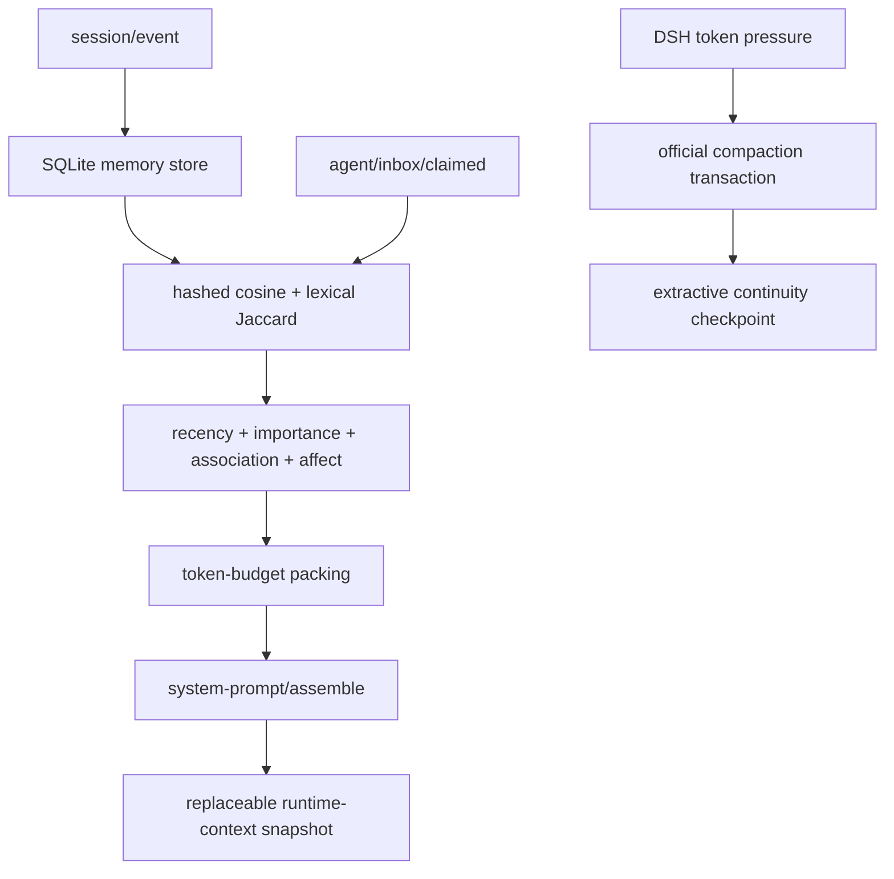

# REMI

> Adaptive Memory for AI · DeepSeek Harness 插件 · v0.2.0

[English](README.md) | [简体中文](README.zh-CN.md)

REMI 是一个面向 [DeepSeek Harness](https://github.com/deepseek-ai/deepseek-harness) 的上下文与长期记忆插件。它监听 DSH 的持久化会话事件，将可检索记忆保存到 SQLite，并在每次模型请求前组装一个受 token 预算约束的 runtime-context window。

REMI 不是独立 Web 应用，不替换 Harness Agent Loop，也不训练或微调模型。

> **当前状态：**早期测试版本，请勿用于生产环境。

## 功能

- 通过 `session/event` 观察 `user/message`、`assistant/message` 和 `tool/result`。
- 使用 Node.js 内置 `node:sqlite` 保存记忆、affect 提示、检索 trace 和关联边。
- 在 `agent/inbox/claimed` 捕获当前查询，通过 `system-prompt/assemble` 注入一个有界的 runtime-context snapshot。
- 使用 hashed bag-of-tokens cosine、lexical Jaccard、recency、importance、association 和 affect 对候选记忆进行排序。
- 对同一检索窗口内共同选中的记忆执行有界 Hebbian 强化。
- 可选通过 DSH `ctx.llm.stream()` 获取结构化 affect JSON；不涉及模型训练，调用失败时回退到本地启发式。
- 继承官方 `BasicCompactionEngine`，保留 Harness 压缩事务，只替换 checkpoint 摘要策略。
- 输出不包含原始 query 的 JSONL telemetry，并在 SQLite 中保存完整 `RetrievalTrace`。

## 环境要求

- Node.js `^22.19.0 || >=24.0.0`
- pnpm `11.x`
- DeepSeek Harness API `0.1.5-rc.2`，或已经通过兼容性验证的 DSH Desktop 版本

当前编译基线为 DeepSeek Harness 提交 `c291e7961a515f6d7af9304e7fd1d257929aef26`。已核对的接口与升级检查清单见 [API 兼容性说明](docs/API_COMPATIBILITY.md)。

## 安装与构建

```powershell
git clone https://github.com/Hoshino910/REMI.git
cd REMI
pnpm install
pnpm build
pnpm typecheck
pnpm test
```

构建后的 DSH 插件入口位于：

```text
packages/dsh-adapter/dist/index.js
```

## 接入 DeepSeek Harness

仓库提供两种配置示例：

- [examples/deepseek-harness/cordis.yml](examples/deepseek-harness/cordis.yml)：用于当前 `standard`/`ptc` preset。请使用该片段替换 preset 中完整的 `id: compaction` group。
- [examples/deepseek-harness/cordis.patch.yml](examples/deepseek-harness/cordis.patch.yml)：用于仍在 root composition 中挂载 `id: compaction-basic` 的 profile。

启动 DSH 前，先把插件路径和数据路径改成本机绝对路径：

```yaml
- id: selective-memory
  name: 'file:///C:/path/to/REMI/packages/dsh-adapter/dist/index.js'
  config:
    databasePath: 'C:/path/to/dsh-data/remi.sqlite'
    telemetryPath: 'C:/path/to/dsh-data/remi-telemetry.jsonl'
    telemetryEnabled: true
    transparentWindowEnabled: true
    retrievalTokenBudget: 1400
    retrievalLimit: 8
    minRetrievalScore: 0.12
    similarityWeight: 0.55
    recencyWeight: 0.15
    importanceWeight: 0.10
    associationWeight: 0.15
    emotionWeight: 0.05
    hebbianEnabled: true
    emotionAnalysisEnabled: false
    compactionSummaryTokenBudget: 900
    compactionThresholdRatio: 0.80
    compactionRetainRatio: 0.16
    autoCompaction: true
```

Windows 上的 DSH Desktop ESM loader 要求插件入口使用 `file:///C:/...` URL，不能直接使用 `C:/.../index.js` 路径。

使用额外 patch 启动 profile：

```powershell
dsh --profile web --patch C:/path/to/cordis.patch.yml
```

同一个 Cordis realm 中只能存在一个 `ctx.compaction` provider。挂载 REMI 前，需要禁用原来的 `compaction-basic`，或按照示例替换完整的隔离 compaction group。

## 配置参考

### 存储与 telemetry

| 配置项 | 默认值 | 说明 |
|---|---:|---|
| `databasePath` | `.dsh-memory/memory.sqlite` | SQLite sidecar 路径；部署时建议使用绝对路径 |
| `telemetryPath` | `.dsh-memory/telemetry.jsonl` | JSONL telemetry 路径 |
| `telemetryEnabled` | `true` | 是否启用 JSONL telemetry |
| `maxCandidates` | `2000` | 一次检索最多加载的记忆数 |
| `maxMemoryChars` | `8000` | 从单个事件写入记忆的最大字符数 |

SQLite 数据库包含原始会话文本，应至少使用与 Harness session store 相同强度的本地权限保护。不要把 SQLite、WAL、SHM 或 telemetry 文件提交到 Git。

### 检索与透明窗口

| 配置项 | 默认值 | 说明 |
|---|---:|---|
| `transparentWindowEnabled` | `true` | 是否在 prompt assembly 中加入 REMI runtime-context snapshot |
| `retrievalTokenBudget` | `1400` | 单个记忆窗口最终渲染后的 token 预算 |
| `retrievalLimit` | `8` | 单个窗口最多包含的记忆条数 |
| `minRetrievalScore` | `0.12` | 候选记忆的最低归一化总分 |
| `recencyHalfLifeDays` | `30` | recency 双曲衰减的时间尺度 |
| `similarityWeight` | `0.55` | 文本相似度权重 |
| `recencyWeight` | `0.15` | 时近性权重 |
| `importanceWeight` | `0.10` | 消息重要性权重 |
| `associationWeight` | `0.15` | Hebbian 关联权重 |
| `emotionWeight` | `0.05` | affect 接近度权重 |

所有权重会在运行时归一化。`retrievalTokenBudget` 只约束 REMI 渲染的 `<memory-context>`，不是整个模型请求的硬上限。

### Hebbian 关联图

| 配置项 | 默认值 | 说明 |
|---|---:|---|
| `hebbianEnabled` | `true` | 是否启用共激活边 |
| `hebbianSeedLimit` | `4` | 用于关联扩展的高分种子记忆数 |
| `hebbianEdgeLimit` | `256` | 一次检索最多读取的关联边数 |
| `hebbianLearningRate` | `0.08` | 一次共激活的强化系数 |
| `hebbianMaxWeight` | `1` | 单条边的最大保存权重 |
| `hebbianHalfLifeDays` | `45` | 边权重的指数半衰期 |

关联边表示两条记忆曾被共同选中，不代表事实正确、因果关系或用户偏好，也不会训练神经网络。

### Affect 分析

| 配置项 | 默认值 | 说明 |
|---|---:|---|
| `emotionAnalysisEnabled` | `false` | 是否请求 DSH 模型生成结构化 affect JSON |
| `emotionAnalysisProvider` | 空 | 可选固定 provider；留空时使用当前 session 路由 |
| `emotionAnalysisModel` | 空 | 可选固定 model；需要与 provider 同时配置 |
| `emotionAnalysisMaxTokens` | `160` | 分类调用的最大输出 token |

模型分析使用 DSH 已配置的 provider，通过严格 JSON prompt 发起一次推理调用，不包含训练流程。失败时，REMI 会记录错误并使用本地启发式继续当前请求。

```ts
interface EmotionVector {
  valence: number      // -1..1
  arousal: number      // 0..1
  dominance: number    // 0..1
  labels: string[]     // 最多三个短标签
  confidence: number   // 0..1
  source: 'model' | 'heuristic' | 'fallback'
}
```

这些值只作为低权重检索提示，不应被解释为对用户的心理诊断或长期事实。

### Compaction

| 配置项 | 默认值 | 说明 |
|---|---:|---|
| `autoCompaction` | `true` | 是否启用官方 token-pressure 自动压缩 |
| `compactionSummaryTokenBudget` | `900` | extractive checkpoint 的估算预算 |
| `compactionThresholdRatio` | `0.80` | 相对模型上下文容量的触发比例 |
| `compactionRetainRatio` | `0.16` | 压缩事务保留的近期原文比例 |

REMI 继承 `BasicCompactionEngine`。锁、token pressure、surface replacement、手动 flush，以及 `compaction/start` → `compaction/summary` → `compaction/end` 事务仍由 DeepSeek Harness 官方实现负责。

## 工作原理



### 事件观察

Observer 将用户、助手和工具结果中的文本转换为 `MemoryRecord`。REMI 自己生成的消息和 compaction checkpoint 会被忽略，避免形成反馈循环。`(session_id, source_event_seq)` 用于保证同一事件重放时的幂等性。

REMI 只观察安装后的 live event，不会自动回填更早的 session 历史。

### 检索评分

本地确定性相似度占位算法为：

```text
Similarity = 0.65 × hashed bag-of-tokens cosine
           + 0.35 × lexical Jaccard
```

默认候选总分为：

```text
Score = 0.55 × Similarity
      + 0.15 × Recency
      + 0.10 × Importance
      + 0.15 × Association
      + 0.05 × Affect
```

Recency 使用 `1 / (1 + ageDays / halfLifeDays)`。完成候选打包后，REMI 会测量完整 `<memory-context>` 的估算 token；如果包装后的结果超出预算，则从低优先级条目开始移除。

### 透明上下文窗口

REMI 在 `agent/inbox/claimed` 中捕获当前直接用户查询，然后在协作式 `system-prompt/assemble` waterfall 中异步检索。插件 context 使用固定名称 `dsh-selective-memory:transparent-window`。

- 一次 assembly 中只存在一个 REMI window；
- 当前 DSH runtime-context snapshot 会在 active surface 中替换较早的 snapshot；
- DSH durable log 仍保存 snapshot event，用于重放和审计。

因此，“透明”表示用户不需要手动复制摘要或管理 context block，不表示隐藏注入或不写日志。

## SQLite schema

Schema v2 包含：

- `memories`：文本、hashed embedding、importance、affect、访问计数和来源元数据；
- `retrieval_traces`：完整的评分和选择 trace；
- `memory_associations`：session 内规范化的共激活边；
- `schema_meta`：schema 版本。

打开 v1 数据库时，store 会添加 `emotion_json`、创建关联表和索引，并更新 schema version。

## Telemetry 与 RetrievalTrace

JSONL 事件类型：

- `plugin/started`
- `memory/ingested`
- `memory/retrieval`
- `memory/window`
- `memory/emotion-analysis`
- `memory/compaction`
- `plugin/error`

JSONL telemetry 保存稳定 query fingerprint，不保存原始 query 或记忆正文。SQLite retrieval trace 包含各项评分、选择决策、token 数量、关联边统计、query affect 元数据和耗时。

## Benchmark

运行仓库自带数据集：

```powershell
pnpm benchmark
```

运行自定义 JSONL 数据集：

```powershell
node packages/benchmark/dist/cli.js C:/path/to/dataset.jsonl
```

输入格式见 [examples/benchmark/sample.jsonl](examples/benchmark/sample.jsonl)。当前 runner 提供 `full`、`similarity_only`、`no_recency` 和 `no_importance`。`hitRateAtK` 只是字符串证据管线检查，不是完整质量评估。

## 工程结构

```text
packages/
  core/             # 与 DSH 解耦的类型、评分、budget、compaction 与 trace
  store-sqlite/     # SQLite MemoryStore 与 schema migration
  dsh-adapter/      # DSH 事件、透明窗口、affect 调用、compaction 与 telemetry
  benchmark/        # JSONL benchmark runner
examples/
  deepseek-harness/ # Cordis group 与 root overlay 示例
  benchmark/        # 最小 benchmark 数据集
docs/
  API_COMPATIBILITY.md
```

`packages/core` 不导入任何 DeepSeek Harness 模块，也不调用模型。DSH 生命周期接入与模型路由只存在于 `packages/dsh-adapter`。

## 开发与验证

```powershell
pnpm build
pnpm typecheck
pnpm test
pnpm benchmark
```

当前验证结果：

- 6 个测试文件、14 项测试通过；
- 所有 workspace package 均可 build 并通过 typecheck；
- DSH Desktop 2.0.6 隔离 headless smoke test 返回 `REMI_LIVE_OK`；
- smoke test 的记忆窗口使用 470 / 600 estimated tokens；
- custom compaction 将 1766 estimated input tokens 压缩为 478 output tokens。

DSH smoke test 使用本地确定性 provider 验证生命周期和 `ctx.llm.stream()` 接口。单独的远程 provider 探测返回 `TRANSPORT: Connection error`；REMI 成功执行 heuristic fallback，但该结果不代表远程服务可用性已经验证。

## 已知限制

- 不自动回填插件安装前创建的 session。
- 不默认提供跨 session 检索作用域。
- Hashed embedding 是占位实现，跨语言和同义表达召回能力有限。
- 尚未实现 current-truth/superseded 冲突消解或删除 API。
- Hebbian 边表达检索共现，不代表事实或因果。
- Affect 提示没有跨语言校准、时间平滑或诊断能力。
- Extractive compaction 结果稳定，但可能遗漏隐含决策或保留过时文字。
- Token 数量为启发式估算；实际压力由 DSH `ctx.tokenMeter` 和模型容量决定。
- DeepSeek Harness 仍处于 pre-release；升级 DSH 包前应重新执行 [升级检查清单](docs/API_COMPATIBILITY.md#upgrade-checklist)。

## License

[MIT](LICENSE)

### 本插件处于早期测试阶段，强烈建议不要加入到生产环境中
